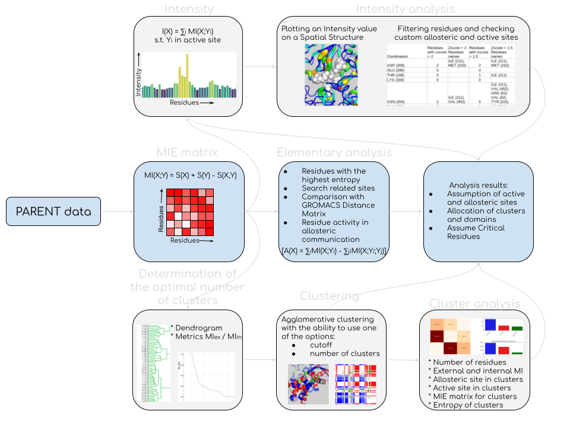

# CLUSTERING
A framework with scripts for the analysis and clustering of molecular systems according to data obtained using the [PARENT](https://github.com/markusfleck/PARENT) or [PARENT_GPU](https://github.com/markusfleck/PARENT_GPU) package.

You will need g++ and python libraries to work: numpy, pandas, seaborn, json, pylab, sklearn and scipy.

 

The last report with a description is in **"report.pdf"** file.

## 0) QUICK START
Set the necessary parameters in the gen_map.sh, tools.sh, clustering.sh and analysis.sh scripts and run in turn:

> bash gen_map.sh

> bash tools.sh

> bash clustering.sh

> bash analysis.sh

## 1) BUILDING A MATRIX OF MUTUAL INFORMATION (present in gen_map.sh):

### 1.1) CONVERTER (YOU NEED TO PROVIDE RAM AT LEAST THE SIZE OF THE .PAR FILE!)

The converter from a binary .par file produces a matrix of mutual information between amino acid residues in json format. The converter is completely written in C ++. No libraries other than STL are required to run this code. To run, specify your C++ compiler in the Makefile (g++ by default). Next use (present in gen_map.sh):

> make clean

> make 

> bin/get_map -f input.par -n project_name

where after the **-f** flag is the path to the binary file, and after the **-n** flag is the desired project name.

### 1.2) DRAWING THE MATRIX

* Script src/python/draw_map.py will draw the resulting matrix. To run use:

> python3 src/python/draw_map.py -n project_name -nodiag

draws a matrix to the ./output/${project_name}/map/ directory. You can also use the **-nodiag** flag (optional) to zero out all diagonal matrix elements for better matrix contrast.

* Script src/python/filtration.py can filter the matrix of mutual information by the exposure of amino acid residues. This script uses pymol to run: the user specifies cutoff as a fraction of the maximum exposure that an amino acid residue in the structure must take in order to be filtered. Pymol calculates the solvent contact surface for each residue and compares it to the maximum value for each residue. To run use:

> python3 src/python/filtration.py -n project_name -strc sctructure.pdb(.gro ...) -cutoff cutoff

draws a matrix to the ./output/${project_name}/map/ directory. The structure must match the molecular dynamics trajectory that was used to derive the PARENT value. Cutoff is specified as a decimal fraction of the total exposure required for a residue to be considered "on the surface" of the protein (example: -cutoff 0.3, to cut out residues with an exposure ratio greater than 30%)

* Script src/python/filtration.py can filter the matrix of mutual information by the exposure of amino acid residues. This script uses GROMACS gmx sasa data (You need the data returned with the -or flag - the average solvent-free surface per residue.): the user specifies cutoff as a fraction of the maximum exposure that an amino acid residue in the structure must take in order to be filtered. To run use:

> python3 src/python/sasa_filtration.py -n project_name -strc sctructure.pdb(.gro ...) -cutoff cutoff -sasa sasa_file.xvg

draws a matrix to the ./output/${project_name}/map/ directory. The structure must match the molecular dynamics trajectory that was used to derive the PARENT value. Cutoff is specified as a decimal fraction of the total exposure required for a residue to be considered "on the surface" of the protein (example: -cutoff 0.3, to cut out residues with an exposure ratio greater than 30%). The data from the GROMACS is input in the .xvg format file.

## 2) CLUSTERING AND CLUSTER ANALYSIS (present in clustering.sh) :

### 2.1) CONSTRUCTION OF METRIC GRAPHS FOR EVALUATION OF THE OPTIMAL NUMBER OF CLUSTERS

Script src/python/opt_num_of_clust.py will draw this graphs. To run use:

> python3 src/python/opt_num_of_clust.py -n project_name -min min_num_of_clust -max max_num_of_clust

draws a graphs to the ./output/${project_name}/clustering/ directory. The **-min** and **-max** flags are optional and reflect the minimum and maximum number of clusters in the system.

### 2.2) CLUSTERING 

The src/python/clustering.py script performs clustering according to the existing matrix and builds a hierarchical clustering dendrogram in the ./output/${project_name}/clustering/ directory. To run use:

> python3 src/python/clustering.py -n project_name -nclust num_of_clust

where after the **-nclust** flag is the desired number of clusters.

### 2.3) CREATING A PYMOL SESSION

The src/python/create_pse.py script on your pdb file, passed after the **-f** flag, creates a pymol session with the selection of clusters into groups and saves it to the ./output/${project_name}/clustering/ directory. To run use:

> python3 src/python/clustering.py -f input.pdb -n project_name -nclust num_of_clust

### 2.4) CLUSTER ANALYSIS

The src/python/cluster_analysis.py script analyzes the clusters built by the clustering.py program and saves it to the ./output/${project_name}/clustering/ directory. The result of the program is a pdf file, which will contain: 
* a matrix of mutual information between clusters, 
* information about the number of residues in each of the clusters,
* information entropy of each cluster, 
* mutual information of each cluster with an active site (+ normalized to the number of clusters), 
* mutual information of each cluster with an allosteric site (+ normalized to the number of clusters), 
* mutual information of each cluster with the rest of the protein (+ normalized to the number of clusters), 
* the sum of all mutual information of each cluster within itself (+ normalized to the number of clusters), 
* the number of active site residues in each cluster, 
* the number of allosteric site residues in each cluster.
To run use:

> python3 src/python/cluster_analysis.py -f_act act_site.json -asn act_site_name -f_all all_site.json -allsn all_site_name -n project_name -nclust num_of_clust -noseq n(default 0)

The **-f_act** flag sends a file in the .json format with indication of the active site residues in the form of numbers corresponding to their mention in the structure file when calculating the corresponding MD trajectory. The **-f_all** flag is used to pass a .json file indicating the remnants of the allosteric site in the same order. To understand this, you can look at the data with the key real_numbers and the key names in the .json file with the matrix of mutual information. To build such lists by ligand from a structure, you can use the find_area.py script (see the TOOLS section (provided in the tools.py script). If you do not know the active and/or allosteric site, then pass files with empty lists using these flags (it will made more convenient in future versions).The **-asn** and **-allsn** flags pass keys corresponding to the lists of active and allosteric sites in the corresponding .json files.The **-nclust** flag passes the number of clusters that have already been clustered (this script uses data obtained from the clustering script .py). The **-noseq** flag is optional. After it, you can specify the number of residues that should not be taken into account during allosteric interaction along the protein sequence. That is, if this parameter is equal to one, then when calculating the intensity of allosteric communication for the i-th residue, it will not be taken into account its mutual information with i+1 and i-1 residues.

## 3) ALLOSTERY ANALYSIS (present in analysis.sh) :

### 3.1) INFORMATION THEORETICAL ANALYSIS OF RESIDUES IN A PROTEIN

The src/python/critical_resid.py script does not require anything other than the mutual information matrix, which is the core of this framework. This script outputs three graphs to the ./output/${project_name}/analysis/ directory: 
* the information entropy of each residue, 
* the mutual information of each residue with the entire protein, 
* and the proportion of the maximum mutual information of each protein residue from its internal information entropy.
To run use:

> python3 src/python/critical_resid.py -n project_name -noseq n(default 0)

The **-noseq** flag is optional. After it, you can specify the number of residues that should not be taken into account when searching for the maximum mutual entropy along the protein sequence. That is, if this parameter is equal to one, then when calculating the maximum mutual information for the i-th residue, its mutual information with i+1 and i-1 residues will not be taken into account.

### 3.2) CALCULATION OF THE INTENSITY OF RELATIONSHIPS WITH AN ACTIVE SITE

* The src/python/allosteric_site_search.py script receives as input after the **-f** flag a json file with a list of residues in the active site, as well as the name of this list in the received file after the **-asn** flag. This program calculates the intensity of allosteric communication of each residue of the protein with the active site, as the sum of the mutual information of the selected residue with each residue from the active site. Output is made to the ./output/${project_name}/analysis/ directory. To run use:

> python3 src/python/allosteric_site_search.py -f input.json -n project_name -asn list_name

You can also use the **-filt** flag and the **-sasa_filt** flag to use a pymol or gromacs filtered matrix, respectively. The **-noseq** flag is also optional. After it, you can specify the number of residues that should not be taken into account during allosteric interaction along the protein sequence. That is, if this parameter is equal to one, then when calculating the intensity of allosteric communication for the i-th residue, it will not be taken into account its mutual information with i+1 and i-1 residues.

* The src/python/allosteric_site_top10.py script receives as input after the **-f** flag a json file with a list of residues in the active site, as well as the name of this list in the received file after the **-asn** flag. This program calculates the top 10% intensity of allosteric communication of each protein residue with the active site. For each residue from the active site, the residues that are in the top 10% for this residue according to mutual information are selected. The remaining values of the paired mutual information are considered to be zero. Further, for each protein residue, its mutual information with the active site (already filtered) is summed up. Output is made to the ./output/${project_name}/analysis/ directory. To run use:

> python3 src/python/allosteric_site_top10.py -f input.json -n project_name -asn list_name

You can also use the **-noseq** flag. After it, you can specify the number of residues that should not be taken into account during allosteric interaction along the protein sequence. That is, if this parameter is equal to one, then when calculating the intensity of allosteric communication for the i-th residue, it will not be taken into account its mutual information with i+1 and i-1 residues.

* The src/python/zscore.py script receives as input after the **-f** flag a json file with a list of residues in the active site, as well as the name of this list in the received file after the **-asn** flag. This program calculates the intensity of allosteric communication of each residue of the protein with the active site in terms of Z-score, as the sum of the mutual information of the selected residue with each residue from the active site. This script also builds the distribution of mutual information of protein residues with the active site. Output is made to the ./output/${project_name}/analysis/ directory. To run use:

> python3 src/python/zscore.py -f input.json -n project_name -asn list_name

You can also use the **-filt** flag and the **-sasa_filt** flag to use a pymol or gromacs filtered matrix, respectively. The **-noseq** flag is also optional. After it, you can specify the number of residues that should not be taken into account during allosteric interaction along the protein sequence. That is, if this parameter is equal to one, then when calculating the intensity of allosteric communication for the i-th residue, it will not be taken into account its mutual information with i+1 and i-1 residues.

### 3.3) DRAWING THE INTENSITY OF THE RELATIONSHIP WITH THE ACTIVE SITE

The following two scripts are able to draw the intensity of allosteric communication on a protein structure using pymol. 

* The src/python/allostery_paint.py script draws the intensity on the protein structure, which is specified after the -strc flag, the intensity is calculated relative to the active site, given in .json format as a list with the key specified after the -asn flag, in which active site remnants are indicated by numbers that correspond to their ordinal number in the structure file (see above in cluster analysis). You can also specify allosteric using the -allsn and -f_all flags to designate it on the structure (optional). The -sasa_filt, -filt and -noseq flags are also available, which mean the same as in paragraph 3.2). To run use:

> python3 src/python/allostery_paint.py -strc sctructure.pdb(.gro ...) -f_act act_site.json -asn act_site_name -f_all all_site.json -allsn all_site_name -n project_name

* The src/python/allostery_paint_top10.py script does the same, only for the top 10% intensity and the -sasa_filt and -filt flags are not available for it. To run use:

> python3 src/python/allostery_paint_top10.py -strc sctructure.pdb(.gro ...) -f_act act_site.json -asn act_site_name -f_all all_site.json -allsn all_site_name -n project_name

### 3.4) RATING OF "CONNECTIVITY" WITH AN ACTIVE SITE

The result of the src/python/intensity_table.py script is a table of residues, sorted by decreasing intensity of allosteric communication with the active site, in the columns of which is:
* residue,
* intensity with active site,
* average intensity per active site residues,
* standard deviation for active site residues,
* columns with intensity values for each residue from the active site.
To run use:

> python3 src/python/intensity_table.py -f_act act_site.json -n project_name -asn act_site_name

You can also use the **-noseq** flag. After it, you can specify the number of residues that should not be taken into account during allosteric interaction along the protein sequence. That is, if this parameter is equal to one, then when calculating the intensity of allosteric communication for the i-th residue, it will not be taken into account its mutual information with i+1 and i-1 residues.

### 3.5) ANALYSIS OF THE COMMUNICATION OF THE ACTIVE AND ALLOSTERIC SITES

The following two scripts build an allosteric communication score for different combinations of residues from the active site and help evaluate how user-specified active and allosteric sites are "linked" in terms of mutual information and which residues are most important.

* The src/python/zscore_top.py script considers all possible combinations of residues from the active site and for each combination analyzes how many residues from the allosteric site and which fall into the Z-score region >2, >1.5 and >1, and displays the three most associated residues from the protein with this combination. Also (you may need additional libraries) this script creates an excel table with 4 sheets:
* overlap of active site residues for all protein residues with Z-score > 2 (list),
* overlap of active site residues across all protein residues with Z-score > 2 (number),
* overlapping of active site residues by allosteric site residues with Z-score > 1 (list),
* overlap of active site residues over allosteric site residues with Z-score > 1 (number).
The **-noseq** flag is also available. To run use:

> python3 src/python/zscore_top.py -f_act act_site.json -n name -asn act_site_name -f_all all_site.json -allsn all_site_name

* The src/python/intensity_top.py script considers all possible combinations of residues from the active site and for each combination analyzes how many residues from the allosteric site and which fall into the top 10% and displays the three residues most associated with this combination from the protein. The **-noseq** flag is also available. To run use:

> python3 src/python/intensity_top.py -f_act act_site.json -n name -asn act_site_name -f_all all_site.json -allsn all_site_name

## 4) OTHER USEFUL TOOLS (present in tools.sh) :

### 4.1) CREATING A GROUP OF CONTACTS FOR A LIGAND

The program creates a group of protein residues in the file by the **-f** flag with the **-sn** key, which are at the cutoff distance (in angstroms) passed by the **-cutoff** flag from the ligand named **- ligname** in the protein structure file **-strc**. You also need to specify the chain that belongs to the protein by the **-chain** flag. If the lignad is a protein, then instead of the **-ligname** flag, the **-chain2** flag is indicated and the chain number for the ligand protein is given. To run, use:

> python3 src/python/find_area.py -f source.json -sn site_name -chain protein_chain -ligname ligand_name -strc sctructure.pdb(.gro ...) -cutoff cutoff(Angstrom)

### 4.2) MATRIX COMPARISON

The calculation of the Frobenius norm of a given matrix and a custom matrix and the construction of a difference matrix of these normalized matrices is performed using the src/python/matrix_comparison.py script, which receives two json files as input with saved custom matrices after **-f1** and **-f2** and then saves everything to the output passed to the program with the **-o** flag. The **-nodiag** flag is also available. To run, use:

> python3 src/python/matrix_comparison.py -f1 matrix1.json -f2 matrix2.json -o output -nodiag

### 4.3) INTENSITIES COMPARISON

The calculation of the Frobenius norm of a given intensity and a custom intensity and the construction of a difference intensity of these normalized intensities is performed using the src/python/compare_intensities.py script, which receives two json files as input with saved custom intensities after **-f1** and **-f2** and then saves everything to the output passed to the program with the **-o** flag. The **-nodiag** flag is also available. To run, use:

> python3 src/python/compare_intensities.py -f1 intensity1.json -f2 intensity2.json -o output

### 4.4) ALPHAFOLD MATRIX CONVERTER

The script receives as input a matrix from AlphaFold in .json format after the **-f** flag and the path for the output file according to the **-o** flag. The program simply draws this matrix and translates it into the format used by this framework. To run, use:

> python3 src/python/alf2json.py -f matrix.json -o output

### 4.5) XPM MATRIX CONVERTER

The script receives as input a matrix from GROMACS in .xpm format after the **-f** flag and the path for the output file according to the **-o** flag. The program simply draws this matrix and translates it into the format used by this framework. To run, use:

> python3 src/python/xpm2json.py -f matrix.xpm -o output

### 4.6) DRAWING 2D PROJECTION OF THE MD TRAJECTORY

The program draws a two-dimensional projection of the trajectory onto two eigenvectors according to the GROMACS data obtained using gmx anaeig and passed after the **-f** flag in .xvg format and creates an html file with an interactive map in the output passed after the **-o** flag. The plotly library is required to work. To run, use:

> python3 src/python/2dplot.py -f 2dproj.xvg -o output

### 4.7) CREATING A GROMACS INDEX FILE

The script creates an index file in the .ndx GROMACS format for the group passed in the file in the format of this framework after the **-f** flag with the group name specified by the **-grn** flag. The group is created according to the structure data using the **-strc** flag. To run, use:

> python3 src/python/allostery_paint.py -strc sctructure.pdb(.gro ...) -f group.json -grn group_name -o output
