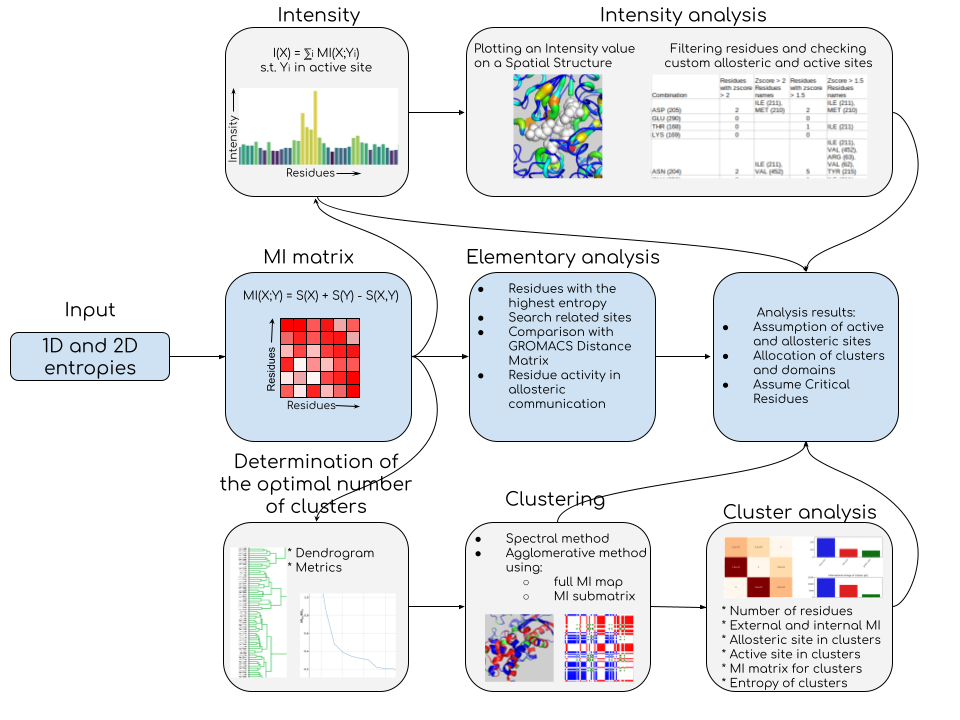

## Overview

ARTEMIS is a universal information-theoretic approach to the study of intramolecular communication, implemented as a program package written in Python/C++. The method is based on the analysis of the matrix of mutual information for all pairs of residues within the protein, obtained from MD data using the PARENT software package ([GitHub](https://github.com/markusfleck/PARENT), [DOI](https://doi.org/10.1021/acs.jctc.5b01217)).

