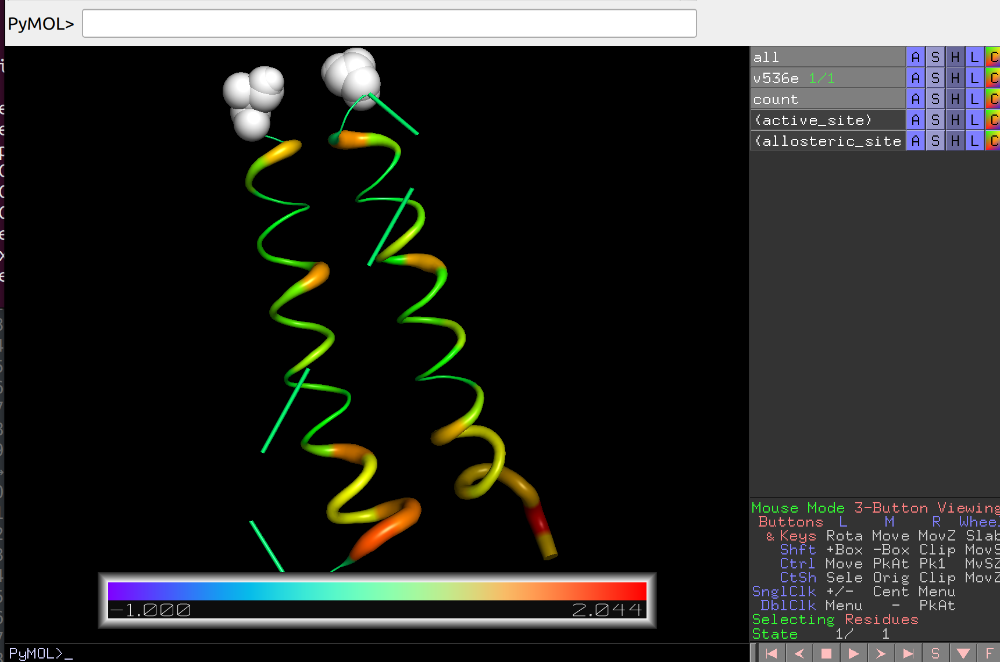

## Tutorial

Here we look at how ARTEMIS can be applied in practice. To do this, let's analyze a small biomolecule consisting of 58 amino acid residues (968 atoms). All used files are located in the `./example/` directory. First, go to the directory and create a folder for the output files:

> cd example

> mkdir output

### MD trajectory

The study begins with molecular dynamics calculations. The molecular dynamics trajectory was obtained using the [GROMACS](https://www.gromacs.org/) 2022 program. The Amber99SB-ILDN force field was used for the calculation, and the standard TIP3P water model was used for solvation of the structure in a cubic cell with periodic boundary conditions. Sodium and chlorine ions were used to neutralize the system. A short (50,000 steps) energy minimization was previously carried out. The temperature of 300K is maintained by a V-rescale thermostat with a coupling constant of 0.1 ps, and the pressure of 1 bar is set by a Parrinello-Rahman barostat with isotropic pressure coupling and a coupling constant of 0.1 ps. After calculating the MD, the protein is centered and the water is removed so that only the trajectory of the protein remains.

### PARENT calculation

PARENT calculation was carried out using the GPU version of the program ([GitHub](https://github.com/markusfleck/PARENT_GPU)). For the calculation, we used the MD trajectory with a length of 200 ns, calculated as indicated above, which was recorded for two different timesteps of 1 and 2 picoseconds, respectively.

### MI Matrix Calculation

We will immediately calculate the matrix without noise. To do this, run:

> artemis map v536e_1ps.par v536e_2ps.par -dt1 5 -dt2 10 --denoise -o output/map.json

By executing the code, you will receive a mutual information matrix in an internal ARTEMIS format. To draw the matrix run:

> artemis map output/map.json --draw -norm -o output/map.pdf

As a result, we obtain a normalized matrix MI without diagonal elements:

### Clustering

Let's create a separate directory for clustering files:

> mkdir output/cluster/

#### Preliminary analysis

Before carrying out clustering, we will build a dendrogram and metrics for determining the optimal number of clusters. To do this, run:

> artemis cluster --study output/map.json -o output/cluster/study.pdf

Having examined the dendrogram and metrics, we determine the number of clusters that is interesting to us. In the tutorial we will explore 4 clusters.

To take into account only the submatrix of protein interaction with a custom group, which is specified in the `v536e_groups.json` file with the `reference_group` key:

> artemis cluster --study v536e_groups.json output/map.json -o output/cluster/study.pdf

#### Spectral clustering

To cluster the mutual information matrix using spectral clustering, run:

> artemis cluster --cluster -spectral -nclust 4 output/map.json -o output/cluster/spectral.pdf

The code running above will create an internal clustering format for ARTEMIS and draw the clustering matrix in pdf format:

Let's display clustering on the structure:

> artemis cluster --draw output/cluster/spectral.json -strc v536e.pdb -o output/cluster/spectral.pse

Which can then be opened in PyMol and analyzed in more detail:

#### Agglomerative analysis

If you carry out agglomerative clustering using the full MI matrix, then the launch is similar to the spectral launch, only without using the `-spectral` flag. Let's carry out agglomerative clustering using the submatrix of protein interaction with the user group, which is specified in the `v536e_groups.json` file with the `reference_group` key. To do this, let's run:

> artemis cluster --cluster v536e_groups.json output/map.json -nclust 7 -o output/cluster/agglomerative_submatrix.pdf

The code running above will create an internal clustering format for ARTEMIS and draw the clustering matrix in pdf format:

#### Clusters analysis

To analyze clustering taking into account the active and allosteric sites specified in the group file `v536e_groups.json`, run:

> artemis cluster --analysis v536e_groups.json output/cluster/spectral.json -o output/cluster/spectral_analysis.pdf

As a result, the following file will be generated:

### Internal communication (allostery search)

***"Warning: in the current version the module that implements this is called "allostery", but in the future it will be renamed."***

Let's create a separate directory for communication files:

> mkdir output/communication/

Let's calculate the intensity of communication with the user site (which is specified in the `v536e_groups.json` file with the `active_site` key), display it on the structure and carry out analysis with the second user group (which is specified in the `v536e_groups.json` file with the `allosteric_site` key).

Calculate the communication intensity by running:

> artemis allostery --search -noseq 2 output/map.json v536e_groups.json -o output/communication/intensity.pdf

The code running above will create an internal intensity format for ARTEMIS and draw the intensity in pdf format:

Now let’s draw the intensity of communication on the structure:

> artemis allostery --draw -noseq 2 -strc v536e.pdb output/communication/intensity.json -o output/communication/intensity.pse

Which can then be opened in PyMol and analyzed in more detail:

Finally, let's analyze the intensity of communication within the system and between the specified sites by running (will create text files):

> artemis allostery --analysis -noseq 2 -zscore output/communication/intensity.json -o output/communication/intensity.pdf

***Good luck in mastering our program! ARTEMIS will continue to develop and new tools will be published in the near future! The manual will also be developed.***
